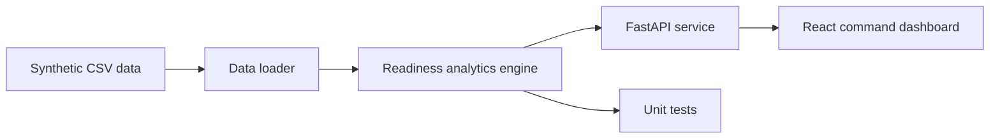

# Architecture

## System Overview

## Data Model

The synthetic model uses six operational domains:

- Assets: aircraft or mission systems with platform, squadron, and maintenance age.
- Missions: scheduled operations with status, delay, and assigned asset.
- Maintenance: open and closed maintenance events with severity and estimated effort.
- Parts: constrained supply items with ETA and criticality.
- Personnel: availability by squadron, role, shift, and clearance.
- Outages: degraded systems that affect planning, maintenance, or cyber workflows.

## Backend

The backend keeps analytics in `backend/app/analytics.py` and API routing in `backend/app/main.py`.

Key choices:

- CSV input keeps the repo public-safe and easy to inspect.
- Analytics use Python standard library code so the core logic is testable without service dependencies.
- FastAPI exposes the decision workflow through simple endpoints.
- What-if analysis returns a projected readiness delta rather than pretending to optimize a full schedule.

## Frontend

The frontend is a Vite React app. It gives the user a work surface, not a marketing page.

Primary views:

- Command: readiness score, root causes, recommendations.
- Assets: asset risk table.
- Timeline: mission execution timeline.
- What-if: intervention controls and projected score.

The UI includes fallback demo data so the dashboard can still render if a reviewer starts the frontend before the API.

## Production Extensions

Natural next steps:

- Replace CSV ingestion with DuckDB/Postgres.
- Add role-based access control.
- Add an event stream for mission and maintenance updates.
- Add lineage for each recommendation.
- Add a solver-backed scheduler for what-if scenarios.
- Add OpenTelemetry traces and structured service logs.

